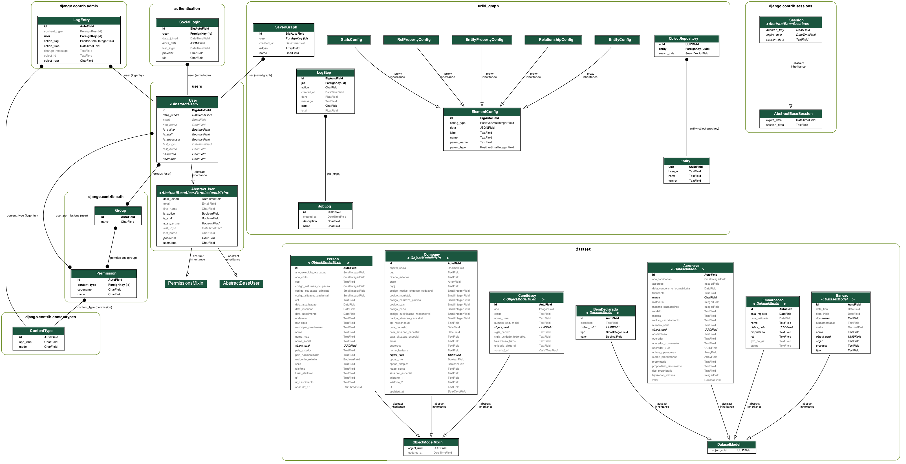

# Instalação

Você precisará do docker compose para rodar a aplicação localmente. Nessa documentação serão mencionados os comandos
completos, mas existem atalhos no `Makefile` (digite `make help` para mais detalhes).

## Executando a aplicação em ambiente de desenvolvimento

Para executar a aplicação você deve ter instalado em sua máquina `git`,
`docker` e `docker-compose`. Inicie clonando o repositório:

```shell
git clone https://git.cnj.jus.br/pdpj/negocio/sniper-backend.git
cd sniper-backend
```

Configure as variáveis de ambiente:

```shell
cp env.example .env
source .env
```

Inicie os containers:

```shell
docker compose up
```

Quando os serviços estiverem prontos, a aplicação (backend) poderá sera
acessada pelo navegador em [localhost:5001](http://localhost:5001).

Carregue as configurações iniciais: execute `docker compose exec web bash` e, dentro
do container execute os seguintes comandos:

```shell
python manage.py create_entities
python manage.py import_config config/element-config.csv
```

Para acessar a interface frontend do Sniper, veja mais detalhes em
[sniper-frontend](https://git.cnj.jus.br/pdpj/frontends/sniper-frontend/).

## Importando os dados

Para importar os dados, siga os passos em
[`dados-ficticios.md`](dados-ficticios.md).


## Configurando o Keycloak

- Acesse o Keycloack em [localhost:8080](http://localhost:8080/)
- Clicar em administration console
- Logar com admin/admin
- Passar o mouse sobre "Master" e clicar em "Add realm"
- Adicionar realm "pdpj"
- Com realm "pdpj" selecionado, clicar em "Clients" > "Create"
- Preencha o formulário com:
  - Em Client ID, preencha "sniper-frontend"
  - Em Client Protocol, selecione "openid-connect"
  - Clique em "Save" e continue na página do client criado, para editar os
    campos abaixo:
  - Digite `*` em "Valid Redirect URIs" e clique no botão "+"
  - Digite `*` em "Web Origins" e clique no botão "+"
  - Clique em "Save"
- Com realm "pdpj" selecionado, clicar em "Clients" > "Create"
  - Em Client ID, preencha "sniper-backend"
  - Em Client Protocol, selecione "openid-connect"
  - Clique em "Save" e continue na página do client criado, para editar os
    campos abaixo:
  - Em Access Type, selecione "bearer-only"
  - Clique em "Save"
  - Ainda na tela desse client, clique em "Credentials" e depois no botão
    "Regenerate Secret"
  - Copie o secret que aparece no campo "Secret" do formulário
- Altere o arquivo `.env` para conter:
  - `export KEYCLOAK_CLIENT_SECRET_KEY=<secret-copiada>` (sem os `<` e `>`)
- Ainda com o realm "pdpj", clique em "Users" > "Add user"
- Preencha o formulário com:
  - Em Username, preencha seu CPF ou "11111111111"
  - Em "Email verified", marque "ON"
  - Clique em "Save"
  - Ainda na tela desse user, preencha os campos:
  - Em "Email", preencha "user1@example.com"
  - Em "First Name", preencha "João"
  - Em "Last Name", preencha "da Silva"
  - Clique em "Save"
- Na tela do usuário criado, clicar em "Credentials", preencher uma senha e a
  confirmação de senha, desmarcar "temporary password" e clicar em "Set"
- Para que a mudança de secret do backend faça efeito, execute `docker compose
  down`, `source .env` e `docker compose up`

## Diagrama de Tabelas e Relacionamentos deste projeto



## Configurações no banco de dados

O backend do Sniper permite a alteração de algumas configurações diretamente no banco de dados, de maneira que nenhuma
alteração no código e/ou deployment precisa ser feita para a alteração de alguns comportamentos.

Para fazer alterações podemos conectar diretamente no banco de dados principal (não recomendado) ou utilizar o Django
admin, que está disponível em:
- [Homologação](https://sniper-api.stg.pdpj.jus.br/admin/urlid_graph/elementconfig/)
- [Produção](https://sniper-api.pdpj.jus.br/admin/urlid_graph/elementconfig/)

Caso precise de acesso ao Django Admin, basta criar um usuário pelo terminal da aplicação com o comando:

```sh
python manage.py createsuperuser
```

> Atenção: por questões de segurança, esse usuário não terá acesso ao sistema via frontend do Sniper.

### Configuração: `custom.unauthorized-profile`

Para alterá-la, acesse `/admin/urlid_graph/elementconfig/` e busque por um objeto com o nome dessa configuração.
Mensagem exibida quando usuário não tem permissão para acessar o Sniper.
A configuração de quais papeis podem acessar o Sniper está na variável de ambiente `ALLOWED_PROFILES`.
